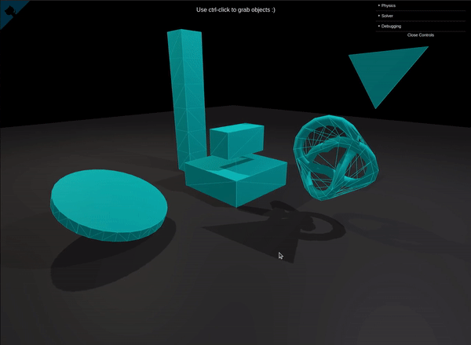
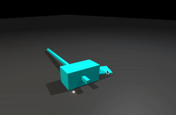

# THREE.js feat. XPBD physics 🌈
Based on Extended Position Based Dynamics by [Matthias Müller](https://github.com/matthias-research). 

Refer to the [docs directory](./docs/) to view the papers and source code used in this project. 

Demo: https://eastingandnorthing.github.io/three/ 

## Development
`npm install` - Install dependencies

`npm run dev` - Runs the Vite.js dev server

`npm run build` - Build the project

## Features

### Core
- [x] XPBD update loop 
- [x] XPBD World / body manager
- [x] Rigid bodies
- [x] `applyForce()`
- [ ] `applyTorque()`

### Collision solver
- [x] Penetration
- [x] Restitution
- [x] Friction
- [x] Broad phase (AABB)
- [x] Narrow phase (GJK / EPA)
- [x] Convex hull generation
- [ ] Broad phase (sorting algorithm)
- [ ] Broad phase (spatial subdivision / octree)
- [ ] Narrow phase (optimized primitives: spheres, capsules)
- [ ] Contact manifold generation / clipping
- [ ] Object pool for Vec3 instances

### Constraints
- [x] Basic constraint
- [x] Mouse picking/dragging
- [x] Calculate constraint force
- [x] Damping
- [ ] Swing / twist limits
